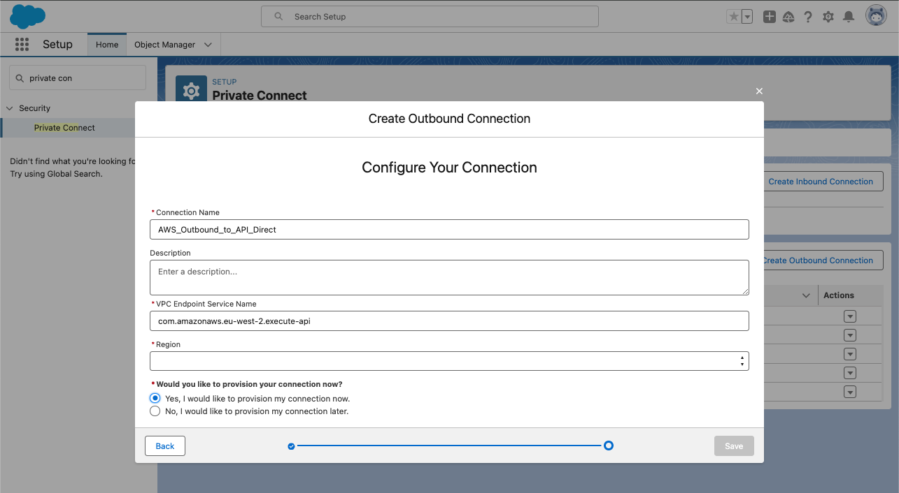
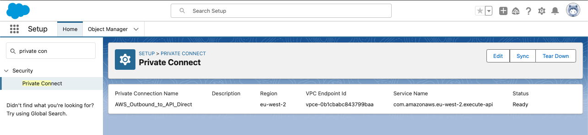
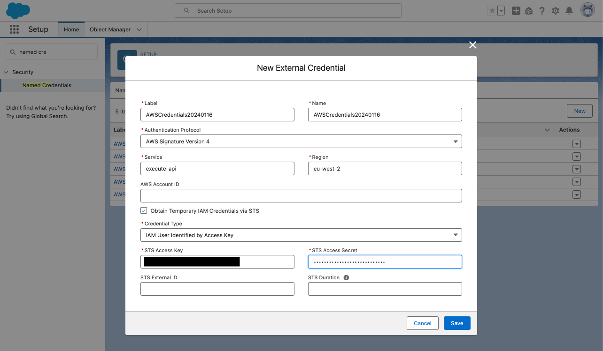
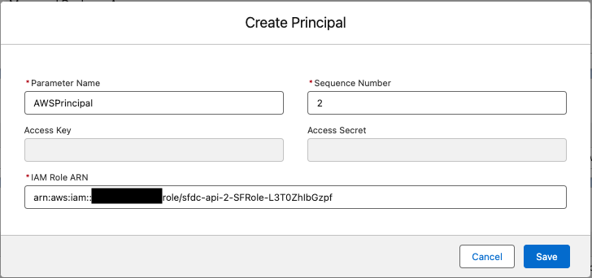
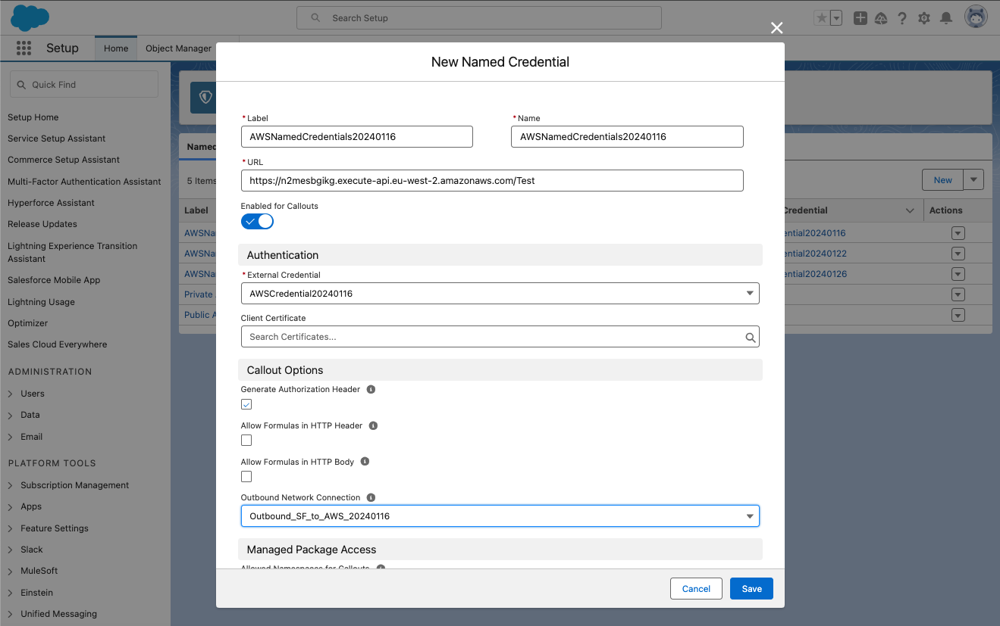
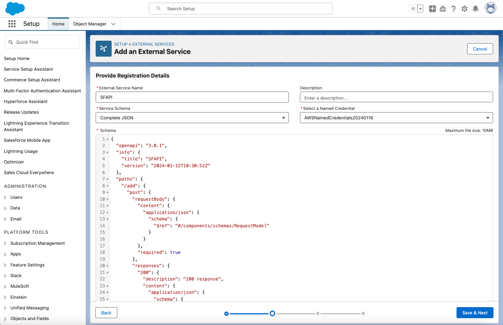
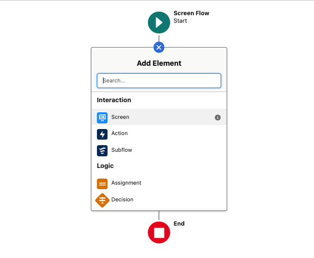
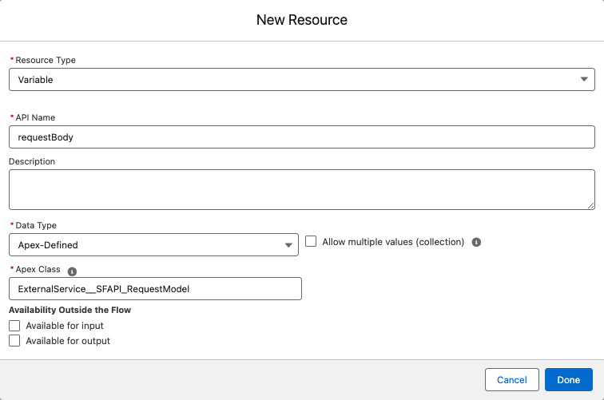
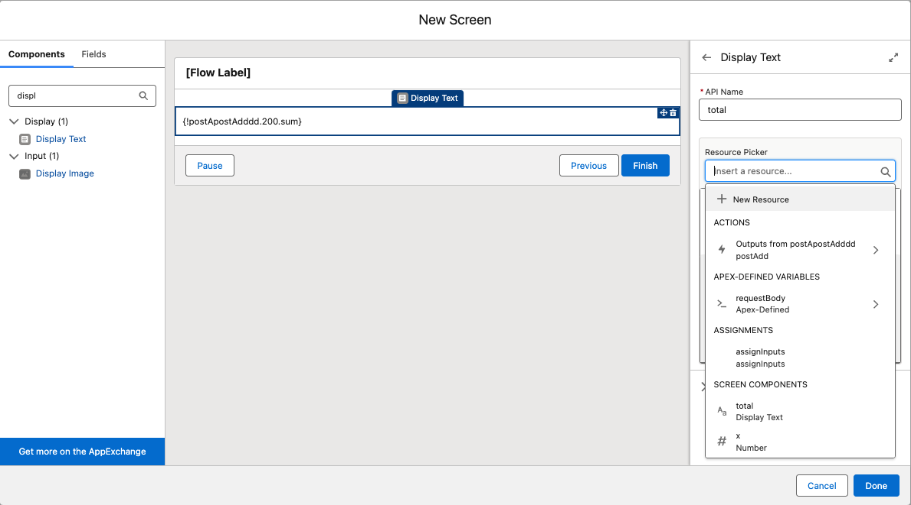

# Private Integration between Salesforce and Amazon API Gateway

This solution demonstrates how to implement a secure private integration between Salesforce and a private [Amazon API Gateway](https://aws.amazon.com/api-gateway/) using [AWS PrivateLink](https://aws.amazon.com/privatelink/) technology to support a synchronous user experience while meeting security and performance requirements. The integration can be leveraged in a Salesforce Flow.
<!-- 
## AWS Blog post
The AWS blog post providing further business context around the solution can be found at https://aws.amazon.com/blogs/ #TODO -->

## Architecture Overview
The architecture below shows how the Salesforce features [Salesforce Private Connect](https://developer.salesforce.com/blogs/2020/05/introducing-salesforce-private-connect), [Named Credentials](https://help.salesforce.com/s/articleView?id=sf.nc_named_creds_and_ext_creds.htm), and [External Services](https://help.salesforce.com/s/articleView?id=sf.external_services.htm) are leveraged to simplify the setup of a secure, private, authenticated connection between your Salesforce and AWS environments.  Salesforce Private Connect provides a secure private connection with AWS using AWS PrivateLink. Named Credentials 
allows authentication tokens for external services to be stored in the Salesforce organisation’s encrypted credential store. 

By using these features, critical data can flow from the Salesforce environment to AWS without using the public internet. The traffic will be routed from the Salesforce managed VPC through an API Gateway VPC Endpoint before being routed to the private API in the customer account.  


*Figure 1 - Solution Overview*

## Solution walkthrough
1. Salesforce External Services allows you to upload an OpenAPI specification exported from the API Gateway to automatically generate invocable actions that can be used in Flow Builder to make callouts to the API Gateway.
1. Salesforce Private Connect leverages AWS PrivateLink to provide a secure private connection between a Salesforce managed [Virtual Private Cloud](https://aws.amazon.com/vpc/) (VPC) and your AWS account. 
1. Named Credentials remove the need to embed a physical URL into your Flow and manage authentication tokens in unencrypted data stores. Invocable Actions generated by an External Service will look up the Named Credential at runtime to configure the physical endpoint along with the authorization credentials from an encrypted credential store. You securely store your AWS credentials in the Named Credential. Only Admins will have access to this.
1. The Interface VPC Endpoint allows you to access a [private API](https://docs.aws.amazon.com/apigateway/latest/developerguide/apigateway-private-apis.html) isolated from the public internet.  
1. The API Gateway will be used to provide a REST interface for applications to access data, business logic, or functionality from your backend services.  API Gateway can be integrated with a number of different integration endpoints such as [AWS Lambda](https://aws.amazon.com/lambda/) functions, HTTP endpoints or AWS services.  A private API is only accessible from a VPC so in this example using a Salesforce managed VPC.
1. Before invoking API Gateway, AWS Security Token Service will be used to exchange the credentials stored in the External Credential for short term credentials that have been granted access to the API Gateway.
1. The Lambda function is used to execute the business logic of the request in this example. 

### Costs
The cost of running the walkthrough will be minimal, as it based on serverless technologies which are charge based on consumption.  Three services which will incur a small cost if the walkthrough is left running for a long period of time are:
- [AWS Secrets Manager](https://aws.amazon.com/secrets-manager/pricing/) - $0.40 per month prorated (based on the number of hours)
- [AWS Private Link](https://aws.amazon.com/privatelink/pricing/) - $0.011 per hour in the London (eu-west-2) region – Note this is only deployed if ‘IncludeTestEnv’ is set to ‘true’ when deploying the [AWS CloudFormation](https://aws.amazon.com/cloudformation/) template. 
- [AWS Key Management Service](https://aws.amazon.com/kms/pricing/) (KMS) - $1/month per key (prorated hourly).  Two KMS keys are created by the AWS CloudFormation template, one to encrypt the AWS Secrets Manager Secret and one to protect the Lambda Function [Amazon CloudWatch](https://aws.amazon.com/cloudwatch/) Log Groups.

### Prerequisites
To follow along with this walkthrough, you must make sure that your [AWS Identity and Access Management](http://aws.amazon.com/iam) (IAM) user or role includes permissions to create the resources required as part of the solution, these include:
- Lambda Functions and Layers
- API Gateway REST APIs
- Secrets Manager Secrets
- KMS Keys
- VPC resources (including VPCs, subnets, route tables and VPC Endpoints)
- CloudWatch Logs
- IAM Roles
- IAM Policies
- IAM Users
- Security Groups

### Create Salesforce Private Connect
To create your Outbound Connection, you first need to setup Private Connect which enables private API callouts from Salesforce to a service running in AWS to send or retrieve data. This can be done in a few clicks by creating an **Outbound Connection** where you specify the **AWS VPC Service Endpoint Name** and the **Region**. These should be set to:

| Salesforce Field          | CloudFormation stack output |
| :---                      | :--- |
| Connection Name	          | *\<A name that you define>*  |
| VPC Endpoint Service Name | com.amazonaws.*\<aws-region>*.execute-api |
| Region                    | The region you will deploy the CloudFormation template. This should be one of the supported regions for [Salesforce Private Connect](https://help.salesforce.com/s/articleView?id=sf.private_connect_considerations.htm) |



*Figure 2 - Salesforce Private Connect Setup*

Once you have setup Private Connect and its status turns to “Ready” state, you need to copy the VPC Endpoint Id. This will be used a parameter to the CloudFormation template to configure the resource policy associated with API Gateway to only allow traffic from this VPC endpoint.



*Figure 3 - Salesforce VPC Endpoint Id*

In this example you are using a private API which has to be accessed via an [interface VPC endpoint](https://docs.aws.amazon.com/apigateway/latest/developerguide/apigateway-private-apis.html).  If connecting to a public API, an Outbound Connection would not be required since the public API is available over the internet.  

### Setup AWS
To create your resources, complete the following steps:
- Clone this repository or download the [template](https://github.com/aws-samples/salesforce-apig-integration/blob/main/template.yaml) to your local environment using the `...` button in GitHub
- Sign in to the [AWS CloudFormation console](https://console.aws.amazon.com/cloudformation/home). 
- Select the region where you deployed the Outbound Connection.
- Choose **Create stack** -> **With new resources (standard)**.
- From the **Create stack** page, select **Upload a template file** and then select **Choose file** and select the **template.yaml** file you downloaded earlier and select **Next**

Once the **Create stack** page is displayed the Amazon S3 URL will be populated with a link to the AWS CloudFormation template. Populate the following parameters:
- *APIStageName* – This is the name used to reference a deployment of the private API. You can use a [Stage](https://docs.aws.amazon.com/apigateway/latest/developerguide/set-up-stages.html) to manage and optimize a particular deployment.  The stage name is the first path segment in the Uniform Resource Identifier (URI) of a call to the private API.  You can leave the default value of ‘Test’ or replace with something that is more relevant to your use case (stage names can only contain alphanumeric characters, hyphens, and underscores. Maximum length is 128 characters)
- *IncludeTestEnv* – Set to **true** if you would like to deploy additional resources to test your private API Gateway outside of Salesforce. See [Test in AWS without Salesforce (Optional)](#test-in-aws-without-salesforce-optional) for details.  NOTE: the test resources can be created at a later time by updating the parameter and deploying the stack
- *SFUserName* – This will be used to create an IAM user in your AWS Account. The associated **Access Key** and **Secret Key** should be used later when you are configuring the Named Credential in Salesforce.
- *SFVPCEndPoint* – Include the **VPC Endpoint Id** you copied when creating the Outbound Connection in Salesforce. This will be used to configure the resource policy associated with the private API Gateway to only allow traffic from that VPC endpoint


*Figure 4 - CloudFormation Parameters*

- Click **Next** on the **Configure stack options** page.
- Review the details on the next page and select the three options:
  - **I acknowledge that AWS CloudFormation might create IAM resource**
  - **I acknowledge that AWS CloudFormation might create IAM resources with custom names**
  - **I acknowledge that AWS CloudFormation might require the following capability: CAPABILITY_AUTO_EXPAND**
- Choose **Submit**.

Once the stack has been deployed (approximately 3-5 minutes depending if you are deploying with test resources) the stack will display a status of **CREATE_COMPLETE** in the CloudFormation console.  Once the stack has been deployed the **Outputs** tab will be populated with values that will be used when configuring the Salesforce Named Credential.


*Figure 5 - CloudFormation Outputs*

### Test in AWS without Salesforce (Optional)

When deploying the stack if you set the parameter **‘IncludeTestEnv’** to **‘true’** then additional resources have been deployed allowing you to test access to your private API Gateway via an Interface Endpoint from a Lambda Function deployed to a VPC in your AWS account.

To run the test, navigate to the [Lambda console](https://console.aws.amazon.com/lambda/home#/functions), and open the Lambda function named **{StackName}-VPCEndPointTestFunction-{random characters}**. Click the Test button while on the Code tab, give the test a name and enter a payload such as the example below. Note the structure of the payload is important as validated by API Gateway.

```
{
  "x": 25,
  "y": 10
}
```

Click **Save** and then click **Test** again. You should receive a response similar to one below. This shows the Lambda function behind the API Gateway has been successfully executed and the payload has been returned.

```
{
  "statusCode": 200,
  "body": "{\"sum\": 35}"
}
```

### Setup Salesforce External and Named Credential
Next you need to configure a Named Credential as the callout endpoint and an External Credential that specifies an authentication protocol and permission profile when authenticating with AWS.

First create a new External Credential in Salesforce by specifying an authentication protocol in this example, AWS Signature Version 4. The required authentication parameters can be found from the CloudFormation stack outputs.  The **STS Access Secret** can be retrieved from [AWS Secrets Manager](https://aws.amazon.com/secrets-manager/) using the value of **SFUserSecretKeySecretArn** from the stack outputs. 

In a production environment, [AWS IAM Roles Anywhere](https://docs.aws.amazon.com/rolesanywhere/latest/userguide) is recommended to obtain temporary credentials to the API, this is beyond the scope of this post. If using long lived credentials; the credentials should be rotated regularly and use the principle of least privilege.



*Figure 6 - Salesforce External Credential*

Once you have created the External Credential, you need to create a Principal under the Principals section of the External Credential. For the IAM Role ARN, use the **SFRoleArn** from the stack outputs. Ensure that permission sets or profiles associated with the user who will be calling the API have enabled principal access. For more information on how to enable External Credential principals, check the [documentation](https://help.salesforce.com/s/articleView?id=sf.nc_enable_ext_cred_principal.htm&type=5).



*Figure 7 - Configuring Principals for External Credential*

Next you need to configure a Named Credential which specifies the URL of a callout endpoint which can be found from the CloudFormation stack outputs in our example. You also need to select the External Credential and outbound network connection previously created. Use this [guide](https://developer.salesforce.com/docs/atlas.en-us.apexcode.meta/apexcode/apex_callouts_named_credentials.htm) as a reference if you need additional help in configuring Named Credentials. 



*Figure 8 - Salesforce Named Credential*

If accessing a public API the same approach of using Named Credentials and External Credentials can used for authenticating requests.

### Setup Salesforce External Services
External Services is a tool on the Salesforce platform that provides a no-code mechanism for Salesforce users to call APIs described by OpenAPI Specifications. More detailed information can be found in the help documentation [here](https://help.salesforce.com/s/articleView?id=sf.external_services.htm&type=5).

With External Services, you upload an OpenAPI Specification and it generates invocable actions that can be used in Salesforce Flow Builder. The Invocable Actions mechanism allows developers to package useful code functionality into declarative building blocks. These can be used by admins and other non-coding users natively in a Flow, which interact with external APIs using External Services and leverage Named Credentials for authentication.

To create an External Service, you need to find External Services in your Salesforce’s organization setup, press **Add an External Service** button, and then select the **From API Specification** option.


*Figure 9 - External Service from API Specification*

Enter the name **SFAPI** as the name for your service, select the Named Credential you created earlier and copy-paste the content of the **OpenAPIDef.json** that was downloaded when you cloned the repository or can be downloaded from GitHub via https://github.com/aws-samples/salesforce-apig-integration/blob/main/OpenAPIDef.json and using the `...` button.



*Figure 10 - External Service Configuration*

The OpenAPI definition can be exported from the stage of the API Gateway. The options shown below should be selected if you plan to upload the export to External Services.


*Figure 11 - API Export from API Gateway*

The ‘servers’ element should be removed from the exported file as the information contained is stored in the Named Credential within Salesforce.

### Make Callouts to the API with External Services in Flow
To test the integration, you can use the invocable action generated by your External Service in a Flow. To create a Flow, find Flows in your Salesforce’s organization setup under Process Automation. Then press the **New Flow** button.

Choose the type of Flow you want to build and press **Create**. In this case, we will create a **Screen Flow**.


*Figure 12 - New Flow Configuration Screen*

Screen Flows provide the user with a screen for input. Click on the connection circle after the Screen Flow Start element to add a **Screen** element.



*Figure 13 - Add Input Screen Element to Flow*

Enter **Input Screen** as the label for the screen element and **Input_Screen** as the API Name.


*Figure 14 - Enter Screen Properties for Input Screen*

Next, go to the Components pane and search for the **Number** component. Drag two of these inputs into the screen. Label one **x** and the other **y**. Since these are both required inputs, select the **Require** checkbox. When finished, click **Done**. 


*Figure 15 - Add Components to Input Screen*

The Assignment element in Flow lets you set values in variables. Click on the connection circle after the screen element and search for the **Assignment** element. Enter **assignInputs** as the label and API name for the element. In the Set Variable Values section, click into the Search variables search box and select **New Resource**. We are going to create a variable for the request body.


*Figure 16 - Create New Resource*

Select **Variable** for the Resource Type and enter **requestBody** for the API Name. Then select **Apex-Defined** for the Data Type. Once this is selected, the Apex Class search box will appear. Type in the name of your External Service (**SFAPI**) and select the Apex class (**ExternalService_SFAPI_RequestModel**). Click **Done** when finished.



*Figure 17 - Create Request Body Variable*

Assign values to the x and y parameters of the newly created requestBody variable. Click into the Search variables search box and select **requestBody**, and then select **x** from the expanded menu. Click into the associated Value search box to the right and select **x** under the Screen Components section. Click A**dd Assignment** below to repeat the steps for **y**. Click **Done** when finished.


*Figure 18 - Assign Values to the Request Body Variable*

Click on the connection circle after the Assignment element and search for the **Action** element. In the action search box, type in the name of your External Service (SFAPI) to get a list of the invocable actions generated by it. Select the invocable action **postAdd (externalService-SFAPI.postAdd)**. Enter **postAdd** for the label and API Name. In the body search box under the Set Input Values for the Selected Action section, select your newly assigned **requestBody** variable. Click **Done** when finished.


*Figure 19 - Add New Invocable Action to Flow*

To view the output of the External Service callout, add another **Screen** element to the flow after the Action element. Enter **Output Screen** as the label for the screen element and **Output_Screen** as the API Name. Then go to the Components pane and search for the **Display Text** component. Drag it onto the screen. Enter **total** for the API Name.

Click into the Resource Picker search box on the right and select **Outputs from postAdd**. Then Select **200** followed by **sum** from the expanded menus. Click **Done** when finished.



*Figure 20 - Add Output Screen to Flow*

Save the Flow by clicking **Save** on the top right. Enter **SFAPI Flow** for the label and **SFAPI_Flow** for the API Name. Then hit **Save**.


*Figure 21 - Save Flow*

To test the Flow, select **Debug** at the top. Enter a value for **x** and **y** and press **Next**. Flow Builder will proceed to display the output on the left side and debug details on the right side.


*Figure 22 - Test the Flow*

During this walkthrough you were able to rapidly setup Salesforce Private Connect, create an invocable action and build a Flow without writing any code.  The Flow was able to call the AWS API Gateway. With this solution, customers can build applications that require synchronous responses to business integration logic hosted in AWS. Customers benefit from higher performance since the traffic is routed over the AWS backbone rather than the public internet.

## Clean up

To avoid incurring future charges, delete the CloudFormation stack that has been provisioned. You should also remove all Salesforce resources created.